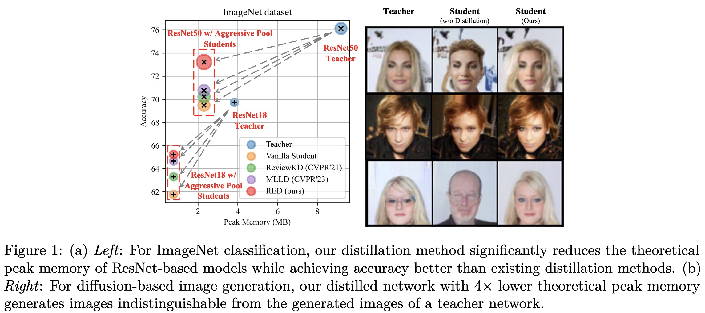
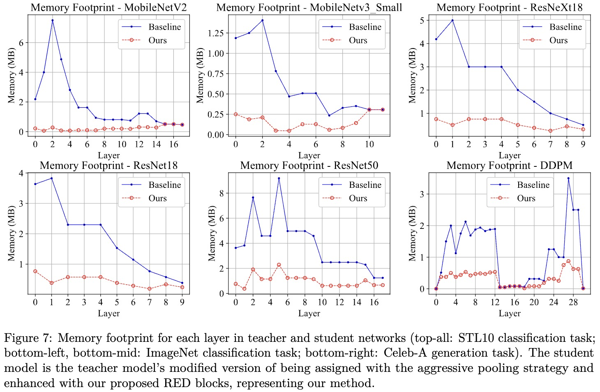

# ReDistill: Residual Encoded Distillation for Peak Memory Reduction of CNN

[Fang Chen](https://c-fun.github.io/), [Gourav Datta](https://godatta.github.io/), [Mujahid Al Rafi](https://mujahidalrafi.github.io/), [Hyeran Jeon](https://www.mocalab.org/), [Meng Tang](http://www.mengtang.org/)

[Arxiv](https://arxiv.org/abs/2406.03744)
 
---

 The expansion of neural network sizes and the enhanced resolution of modern image sensors result in heightened memory and power demands to process modern computer vision models. 
 In order to deploy these models in extremely resource-constrained edge devices, it is crucial to reduce their peak memory, which is the maximum memory consumed during the execution of a model.
 A naive approach to reducing peak memory is aggressive down-sampling of feature maps via pooling with large stride, which often results in unacceptable degradation in network performance.
 To mitigate this problem, we propose residual encoded distillation (ReDistill) for peak memory reduction in a teacher-student framework, in which a student network with less memory is derived from the teacher network using aggressive pooling.
 We apply our distillation method to multiple problems in computer vision, including image classification and diffusion-based image generation.
 For image classification, our method yields $\textbf{4x-5x}$ theoretical peak memory reduction with less degradation in accuracy for most CNN-based architectures. 
 For diffusion-based image generation, our proposed distillation method yields a denoising network with $\textbf{4x}$ lower theoretical peak memory while maintaining decent diversity and fidelity for image generation.
 Experiments demonstrate our method's superior performance compared to other feature-based and response-based distillation methods when applied to the same student network.






## Environment

`pip install -r requrements.txt`

Generally, this code repo is compatible with pytorch version >= 1.5. 

**If you want to try quantization, please install and compile intel [neural_compressor](https://github.com/intel/neural-compressor) and [intel_extension_for_pytorch](https://github.com/intel/intel-extension-for-pytorch)**


## Image Classification Experiments

### STL10 Dataset
- please edit .sh file to enable multi-gpu training
- change the value of ROOT variable to your own local root directory

```shell
> cd ./base
# mobilenetv2 -> mobilenetv2x4
> bash run_classification.sh distill \
               mobilenetv2-4-1221111 mobilenetv2-1-1222121 \
               ./ckpt/mobilenetv2-1-1222121_stl10_imsize128_batchsize8_lr0.01_optimizerSGD.pth \
               ./configs/mobilenetv2-red.yaml
# mobilenetv3_small -> mobilenetv3_smallx4
> bash run_classification.sh distill \
               mobilenetv3_small-4-22111111111 mobilenetv3_small-1-22121111211 \
               ./ckpt/mobilenetv3_small-1-22121111211_stl10_imsize128_batchsize8_lr0.01_optimizerSGD.pth \
               ./configs/mobilenetv3_small-red.yaml
#resnext18 -> resnext18x4
> bash run_classification.sh distill \
               resnext18-4-11221 resnext18-1-21222 \
               ./ckpt/resnext18-1-21222_stl10_imsize128_batchsize8_lr0.001_optimizerAdam.pth \
               ./configs/resnext18-red.yaml
```

### ImageNet Dataset
- please edit .sh file to enable multi-gpu training
- change the last argument (config file) to switch distillation method
```shell
> cd ./pipeline_classification/imagenet/
# resnet50 -> resnet50x4
> bash run_distill.sh reed /mnt/data/imagenet2012/ configs/imagenet/resnet50/reed.yaml
# resnet18 -> resnet18x2
> bash run_distill.sh reed /mnt/data/imagenet2012/ configs/imagenet/resnet18/reed.yaml
# mobilenetv2 -> mobilenetv2x2
> bash run_distill.sh reed /mnt/data/imagenet2012/ configs/imagenet/mobilenetv2/reed.yaml
```

## DDPM-based Image Generation Experiments

### CIFAR10 Dataset
```shell
> cd ./pipeline_ddpm
> bash run_cifar10_distill.sh ./logs/cifar10_distill/ ./config/reedx2_aug_dist_config_alpha50.yaml
```

### CELEBA Dataset
```shell
> cd ./pipeline_diffusion/
> bash run_ddpm.sh /mnt/data2/celeba/ reed ./config/TMLR/CELEBA-REDx2.txt
```

## Efficiency Analysis
- please modify the 'ROOT' variable of the shell script 'analysis/run_sota_analysis.sh' to your root directory

```shell
> cd ./analysis/
# STL10 dataset
# mobilenetv2
> bash run_sota_analysis.sh stl10 mobilenetv2-1-1222121 mobilenetv2-8-1211111 mobilenetv2_x8-red.yaml 100
# mobilenetv3-small
> bash run_sota_analysis.sh stl10 mobilenetv3_small-1-22121111211 mobilenetv3_small-4-22111111111 mobilenetv3_small-red.yaml 500
# resnext18
> bash run_sota_analysis.sh stl10 resnext18-1-21222 resnext18-4-11221 resnext18-red.yaml 100

# ImageNet dataset
# resnet18
> bash run_sota_analysis.sh imagenet ResNet18 ResNet18_aggressive_pool reed resnet18/reed.yaml resnet18/reed_dist_config.yaml 100
# resnet50
> bash run_sota_analysis.sh imagenet ResNet50 ResNet50_aggressive_pool reed resnet50/reed.yaml resnet50/reed_dist_config.yaml 100
# mobilenetv2
> bash run_sota_analysis.sh imagenet ResNet152 MobileNetV2_aggressive_pool_x2 reed mobilenetv2/reed.yaml mobilenetv2/reed_dist_config.yaml 100

# DDPM
> bash run_sota_analysis.sh ddpm ddpm ddpmx2 reedx2_dist_config_alpha0.1.yaml 200
```

## Acknowledgements

This code repo highly relies on [RepDistiller](https://github.com/HobbitLong/RepDistiller), [MLLD](https://github.com/Jin-Ying/Multi-Level-Logit-Distillation) and [pytorch-ddpm](https://github.com/w86763777/pytorch-ddpm).
We sincerely thank these authors for their nice work.

## Citation
This work is accepted by TMLR 2025.
If you find this work useful for your research, please cite our paper:

```text
@misc{chen2024redistillresidualencodeddistillation,
      title={ReDistill: Residual Encoded Distillation for Peak Memory Reduction}, 
      author={Fang Chen and Gourav Datta and Mujahid Al Rafi and Hyeran Jeon and Meng Tang},
      year={2024},
      eprint={2406.03744},
      archivePrefix={arXiv},
      primaryClass={cs.CV},
      url={https://arxiv.org/abs/2406.03744}, 
}
```